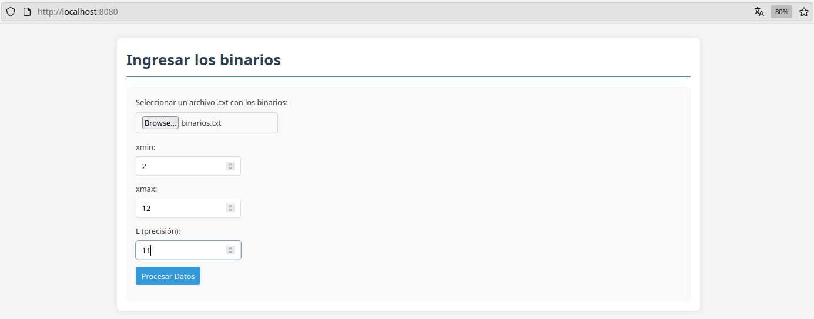
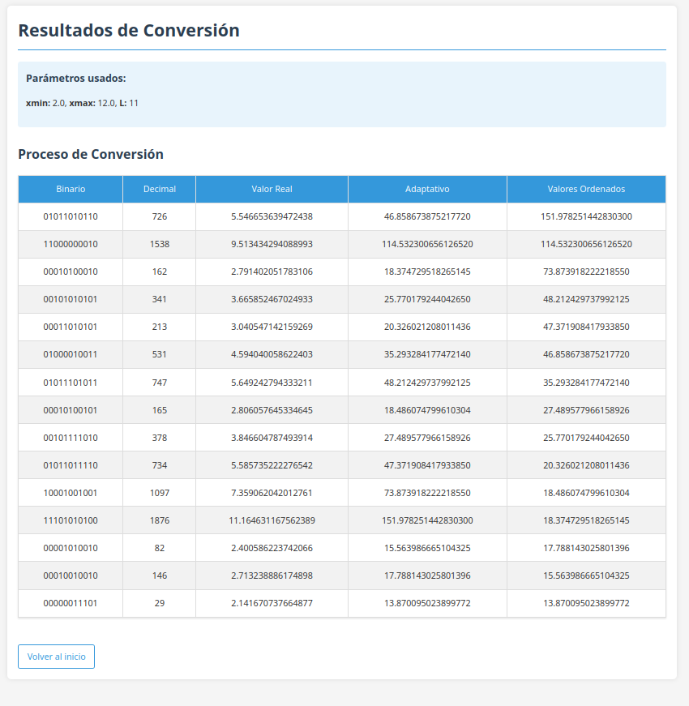

# Proyecto tabla

Recibimos via archivo `.txt` una lista de numeros binarios que conformaran la tabla, despues se solicitan los valores 'xmin', 'xmax' y 'L', para proceder a generar la tabla con los calculos.

## Ejemplo de uso

> Recordar ejecutar el proyecto e ir al http://localhost:8080

Al ingresar los datos damos a `Procesar los datos`:

Despues nos redirige a la tabla generada, recordandonos los valores ingresados previamente:

